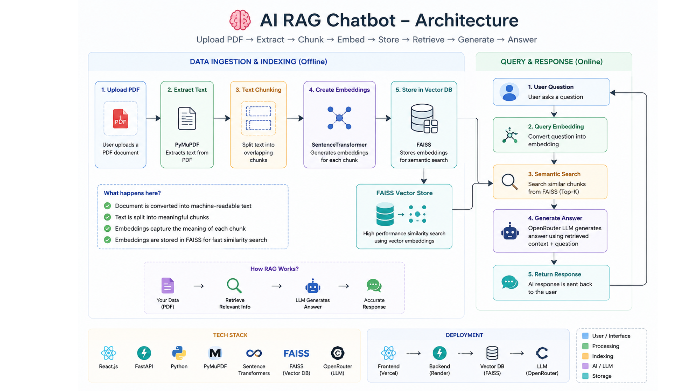
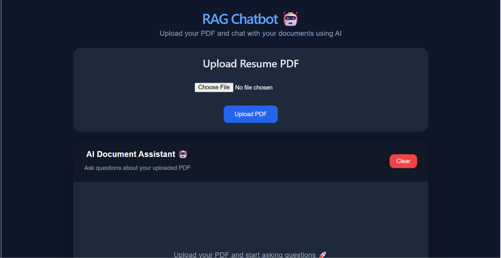
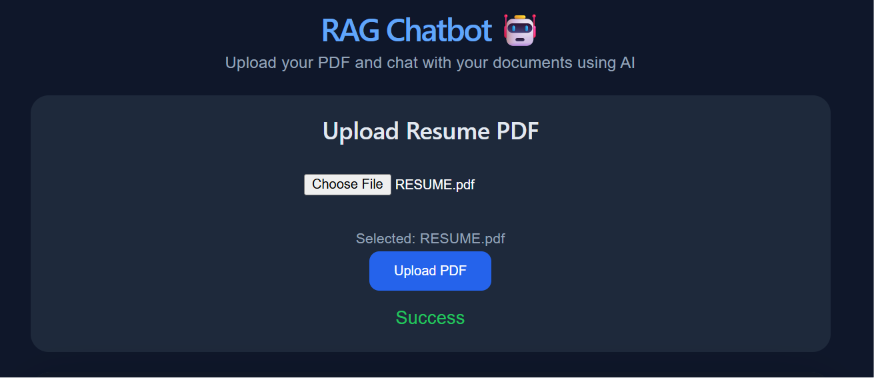
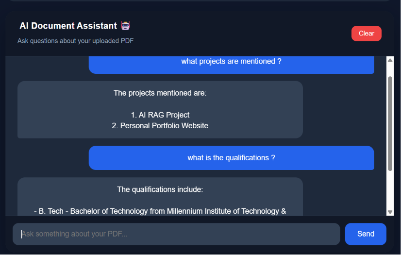

# 🤖 AI RAG Chatbot

<p align="center">

AI-powered PDF Question Answering System using **Retrieval-Augmented Generation (RAG)**.

Upload a PDF, ask questions in natural language, and receive context-aware answers powered by semantic search and Large Language Models.

</p>

---

## 🚀 Demo

<p align="center">


</p>

---

## 🌐 Live Demo

🔗 **Frontend:** https://ai-rag-chatbot-frontend.vercel.app/

---

## 🏗 Architecture

<p align="center">



</p>

---

## 🎯 Key Highlights

- ⚡ End-to-end Retrieval-Augmented Generation (RAG) pipeline
- 📄 Semantic search over PDF documents using FAISS
- 🧠 Context-aware answers powered by OpenRouter LLM
- 🌐 Full-stack architecture with React + FastAPI
- ☁️ Live deployment on Vercel and Render

# ✨ Features

- 📄 Upload PDF documents
- 🧠 Generate semantic embeddings using Sentence Transformers
- ⚡ Store vectors using FAISS
- 🔍 Retrieve relevant chunks through similarity search
- 🤖 Generate AI-powered responses with OpenRouter LLM
- 💬 Interactive React chat interface
- 🚀 FastAPI REST backend
- 🌍 Deployed on Vercel & Render
- 📱 Responsive UI

---

# 📸 Screenshots

## 🏠 Home Page

<p align="center">



</p>

---

## 📤 Upload PDF

<p align="center">



</p>

---

## 💬 Chat Response

<p align="center">



</p>

---

# 🛠 Tech Stack

## Frontend

- React.js
- JavaScript (ES6+)
- CSS3
- Fetch API

---

## Backend

- FastAPI
- Python
- Uvicorn

---

## AI / Machine Learning

- Sentence Transformers
- FAISS
- OpenRouter LLM

---

## Deployment

- Vercel
- Render

---

# ⚙ How It Works

```text
Upload PDF
      │
      ▼
Extract Text
      │
      ▼
Split into Chunks
      │
      ▼
Generate Embeddings
      │
      ▼
Store in FAISS
      │
      ▼
User asks Question
      │
      ▼
Retrieve Relevant Chunks
      │
      ▼
OpenRouter LLM
      │
      ▼
AI Response
```

---

# 📂 Project Structure

```text
AI-RAG-Chatbot
│
├── assets
│   ├── architecture.png
│   ├── demo.gif
│   ├── home.png
│   ├── upload.png
│   └── chat.png
│
├── frontend
│
│   ├── src
│   ├── public
│   └── package.json
│
├── backend
│
│   ├── app.py
│   ├── embeddings.py
│   ├── vector_store.py
│   ├── llm.py
│   └── requirements.txt
│
└── README.md
```

---

# ⚙ Installation

## Clone Repository

```bash
git clone https://github.com/rashidhusain01/AI-RAG-Chatbot
```

---

## Frontend

```bash
cd frontend

npm install

npm run dev
```

---

## Backend

```bash
cd backend

python -m venv venv

venv\Scripts\activate

pip install -r requirements.txt

uvicorn app:app --reload
```

---

# 📡 API Endpoints

## Upload PDF

```http
POST /upload
```

Uploads a PDF, extracts text, generates embeddings, and stores vectors in FAISS.

---

## Chat

```http
POST /chat
```

Returns AI-generated answers using Retrieval-Augmented Generation.

---

# 🔮 Future Improvements

- Multi-PDF Support
- User Authentication
- Chat History
- Streaming AI Responses
- Docker Compose Deployment
- Persistent Vector Database
- Cloud Storage Integration
- Admin Dashboard

---

# 👨‍💻 Author

## Rashid Husain

**GitHub**

https://github.com/rashidhusain01

**LinkedIn**

https://www.linkedin.com/in/rashid-husain-/

**Portfolio**

https://rashidhusain01.github.io/portfolio/

---

## ⭐ If you found this project useful, please consider giving it a Star.